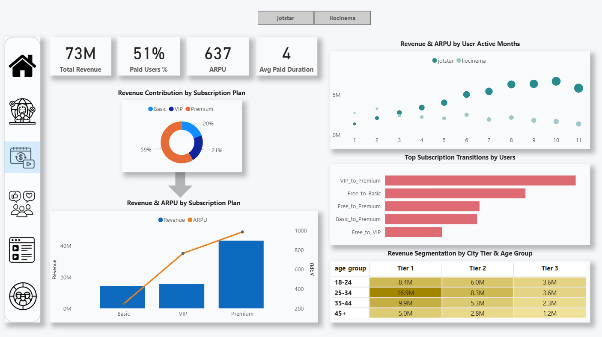

# OTT Platform Merger Analysis
End-to-end analytics project evaluating merger impact of two OTT platforms

## 📌 Problem Statement
Two OTT platforms are planning a strategic merger and the management team of Platform A requires a comprehensive analysis of **performance and user behavior of both platforms** over the past year (January-November 2024). 

This potential partnership aims to combine **Platform A's large subscriber base** with **Platform B's diverse content library**. 
The goal is to consolidate key business metrics and generate **actionable business insights** to support informed decision-making and optimize content and monetization strategies post-merger.

## 🎯 Objective
- Analyze pre and post merger performance trends
- Understand user engagement, content consumption and inactivity patterns
- Evaluate revenue, ARPU and subscriber growth 
- Analyze subscription updgrade and downgrade along with influencing factors
- Compare content types and subscriber acquistion across demographic segments

## 🧰 Tools Used
- **SQL** - data extraction, joins, views, KPI calculations
- **Power BI** - data modeling, DAX, interactive dashboards
- **Excel** - data standardization & metric validation

## 🔄 Process & Approach
1. Data understanding and schema alignment across platforms  
2. SQL based data cleaning, joins and metric creation  
3. Cross-validation of key metrics using Excel  
4. Power BI data modeling and DAX calculations  
5. Creation of an interactive, business-focused dashboard 

## 📊 Key Insights
- **Revenue growth** is primarily driven by **Platform B users** while Platform A shows higher inactivity
- **ARPU** varies significantly by platform and by user active months 
- Increased inactivity correlates with **lower average watch time**, indicating content engagement gaps  
- Certain content categories perform consistently across both platforms and can be leveraged for cross-promotion 

## 📉 Dashboard Highlights
- Revenue & ARPU by platform  
- Active vs inactive user trends
- Content performance distribution  
- Watch time analysis by device and city  

🔗 **Power BI Dashboard Link:** https://app.powerbi.com/view?r=eyJrIjoiODk3OGExMWUtZDlhNC00ZGE5LWJiNTctMWFiY2ZkZmMyNjQxIiwidCI6ImM2ZTU0OWIzLTVmNDUtNDAzMi1hYWU5LWQ0MjQ0ZGM1YjJjNCJ9
 
## 🧠 Business Recommendations
- Prioritize retention campaigns for inactive users with declining watch time  
- Cross-promote high performing content across platforms  
- Optimize pricing and subscription plans based on ARPU segmentation  
- Focus marketing investments on cities and devices with higher engagement  

## 📂 Repository Structure
```text
├── Data/           # Sample Schema
├── SQL/            # SQL queries 
├── Screenshots/    # Power BI dashboard screenshots
└── README.md
